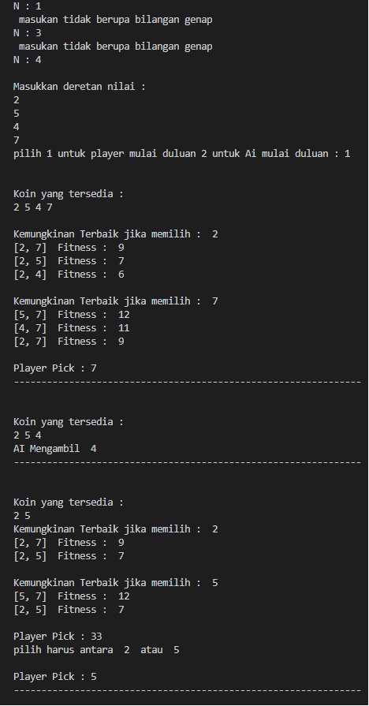
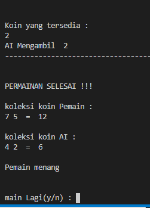

# N-Coin-In-A-Line-AlgoritmaGenetika

### referensi
https://www.educative.io/edpresso/what-is-the-coin-in-a-line-problem

https://towardsdatascience.com/introduction-to-genetic-algorithms-including-example-code-e396e98d8bf3

### hasil running program

### akhir program

